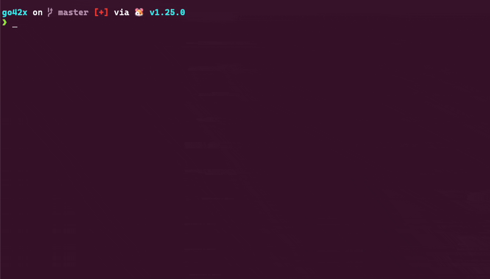

<p align="center">
<a href="https://opensource.org/licenses/MIT"></a>
<a href="https://golang.org/"></a>
<a href="https://github.com/hasansino/commit/releases"></a>
</p>

# commit

Commit helper tool.

## Installation

Native Git 2.25 or newer is required.

### Homebrew

```bash
brew tap hasansino/commit
brew install commit
```

### Go

```bash
go install github.com/hasansino/commit@latest
```

### Download Binary

Download the latest binary from the [releases page](https://github.com/hasansino/commit/releases).

## Features

- Dry-run mode
- Generates messages according to conventional commits specification
- Generates commit messages using cloud providers (claude, openai, gemini) or a local GGUF model
- Supports multi-line commit messages
- Exclude/include specific file patterns and use global gitignore
- Customizable commit message prompt templates
- Configurable maximum diff size to include in prompts
- Supports semantic versioning tag (major, minor, patch) incrementation and push
- Option to push changes after committing to relevant remote branch
- Native Git signing according to user configuration (OpenPGP, SSH, or X.509)
- Detects JIRA issue keys in branch name and adds them to commit message

## Demo



## Usage

```terminaloutput
Commit helper tool

Usage:
  commit [flags]
  commit [command]

Available Commands:
  help        Help about any command
  version     Version information

Flags:
      --auto                        Automatically select a generated message and commit without opening the UI.
      --dry-run                     Show what would be committed without committing.
      --exclude strings             Exclude patterns, when staging changes.
  -h, --help                        help for commit
      --include-only strings        Only include specific patterns, when staging changes.
      --jira-task-position string   Jira task position in commit message: prefix, infix, suffix, or none. (default "none")
      --jira-task-style string      Jira task style: brackets, parens, plain-colon, or plain. (default "plain")
      --log-level string            Logging level (debug, info, warn, error) (default "info")
      --max-diff-size-bytes int     Maximum diff size in bytes to include in prompts. (default 65536)
      --multi-line                  Use multi-line commit messages.
      --prompt string               Custom prompt template.
      --providers strings           Providers to use (claude|openai|gemini|local). (default [claude,openai,gemini])
      --push                        Push after committing.
      --tag string                  Create and increment semver tag part (major|minor|patch).
      --timeout duration            API timeout. (default 5s)
      --use-global-gitignore        Use global gitignore. (default true)

Use "commit [command] --help" for more information about a command.
```

All flags can also be set via environment variables, e.g. `COMMIT_AUTO=true`.

If changes are already staged, `commit` uses that exact staged set and does not apply
`--include-only`, `--exclude`, or global-gitignore filtering. When nothing is staged,
the tool stages matching changes in an owner-only private index. The repository's real
index remains untouched while providers and the interactive UI run, then is synchronized
only after native `git commit` succeeds. Dry runs, cancellation, and pre-commit failures
remove the private index without publishing its contents.

`--include-only` and `--exclude` values are positive selectors and do not receive
implicit wildcards. A literal such as `log` matches a complete file or directory
name, not `dialog.go`; use an explicit wildcard such as `*log*` when substring
matching is intended. Patterns use `/` as the path separator, and patterns containing
`/`, such as `src/*.go`, are relative to the repository root. Leading `!` negation is
not supported for these command-line selectors. This is similar to gitignore patterns, but with some differences. See the [gitignore documentation](https://git-scm.com/docs/gitignore).

## Configuration

Cloud providers require the corresponding API key:

- ANTHROPIC_API_KEY
- ANTHROPIC_MODEL (optional, defaults to "claude-haiku-4-5")
- OPENAI_API_KEY
- OPENAI_MODEL (optional, defaults to "gpt-4o-mini")
- GEMINI_API_KEY
- GEMINI_MODEL (optional, defaults to "gemini-2.5-flash-lite")

### Local GGUF model provider

The local provider runs the externally installed `llama-cli` executable. It
must be available in `PATH`; `commit` does not install or manage `llama.cpp`.

```bash
commit --providers=local
```

Large diffs may need a longer inference timeout, for example `--timeout=2m`.

On first use, `commit` downloads official
[Qwen3-0.6B Q8_0 GGUF](https://huggingface.co/Qwen/Qwen3-0.6B-GGUF).

Local provider environment variables:

- `LOCAL_MODEL`: existing GGUF path or HTTP(S) URL
- `LOCAL_MODEL_SHA256`: expected checksum for a custom model
- `LOCAL_MODEL_CACHE_DIR`: download cache override
- `LOCAL_CONTEXT_SIZE`: context window in tokens (default `32768`)
- `LOCAL_MAX_TOKENS`: maximum generated tokens (default `64`)
- `HF_TOKEN`: optional Hugging Face token for a private `LOCAL_MODEL` URL

### Custom Prompt Variables

- {diff}: git diff of the changes to be committed
- {files}: list of changed files
- {branch}: current git branch name
